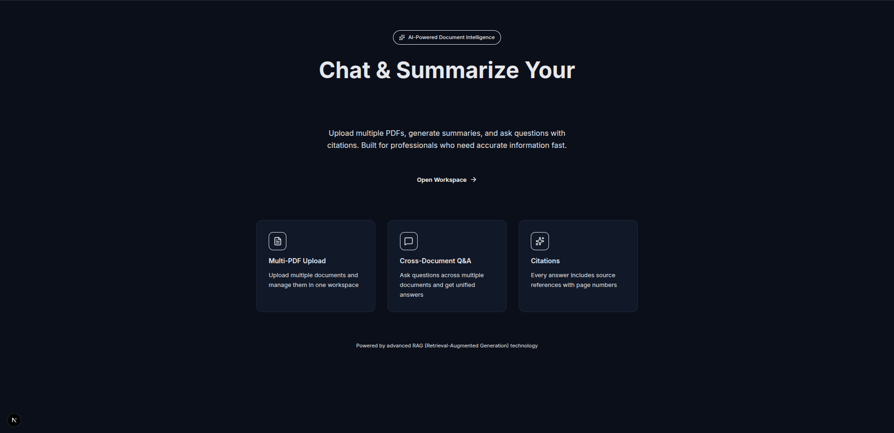

Below is a **full project report** written exactly in the **emoji-heavy, production-ready, developer-centric style** you asked for, mirroring a polished **AI Chatbot report**, but adapted correctly for your **AI Document Summariser & Q/A System**.

You can **directly copy-paste this into your project report / README / PDF**.

---

# 📘 AI Document Summariser & Context-Aware Q&A System

*(Production-Ready RAG Pipeline for Long-Form Documents)*

<p align="center">
  
</p>

---


---

## 🎯 Abstract

The **AI Document Summariser & Context-Aware Question Answering System** is a production-grade application designed to automatically extract, analyze, summarize, and query long-form documents such as PDFs. The system addresses the challenge of information overload by transforming unstructured documents into concise, structured insights while enabling precise question answering grounded strictly in the original content.

Built using **FastAPI**, **React (Vite)**, **LangChain**, and **GPT-4o**, the system follows a **Retrieval-Augmented Generation (RAG)** architecture. Documents are ingested, chunked, indexed, and summarized using a **Map-Reduce summarization strategy**, ensuring scalability and factual grounding.

---

## ⚡ Problem Statement

Modern organizations and individuals deal with massive volumes of documents such as research papers, certificates, reports, and manuals. Manually extracting insights or searching for answers is:

* Time-consuming
* Error-prone
* Not scalable

Traditional summarization tools fail to:

* Maintain document grounding
* Support multi-document reasoning
* Provide traceable citations

---

## 💡 Solution Overview

This project introduces an **AI-powered summarization and Q&A system** that:

* Accepts **multiple PDF uploads**
* Generates **high-density summaries**
* Supports **context-aware Q&A**
* Provides **source-level citations**
* Operates with **session-isolated document memory**

---

## 🔄 System Pipeline

```
PDF Upload
   ↓
PDF Text Extraction
   ↓
Recursive Chunking (Page-aware)
   ↓
Chunk Indexing (BM25 / Vector Ready)
   ↓
Map-Reduce Summarization
   ↓
Context-Aware Q&A with Citations
```

---

## 🧠 Core Pipeline Explained

### 📄 PDF Extraction

* Uses page-level extraction
* Preserves metadata (filename, page number)

### ✂️ Recursive Chunking

* Overlapping chunks preserve semantic continuity
* Prevents context loss in long documents

### 🗺️ Map-Reduce Summarization

| Phase  | Description                                                  |
| ------ | ------------------------------------------------------------ |
| Map    | Each chunk is summarized independently                       |
| Reduce | Partial summaries are merged into a final structured summary |

This design ensures scalability for **large PDFs and multi-document uploads**.

---

## 📊 Summarization Modes

| Mode              | Description              | Use Case       |
| ----------------- | ------------------------ | -------------- |
| Executive Summary | High-level overview      | Stakeholders   |
| Technical Summary | Deep structured analysis | Engineers      |
| Bullet Summary    | Concise points           | Quick review   |
| Custom Length     | User-defined verbosity   | Flexible usage |

---

## 💬 Context-Aware Question Answering

The system implements **Retrieval-Augmented Generation (RAG)**:

1. User question is rewritten into a standalone query
2. Relevant chunks are retrieved
3. GPT-4o answers **only from retrieved context**
4. Every answer includes **citations**

### Example Output:

```
Answer: The certificate confirms successful completion of the program [Source 2].

Citations:
- certificate.pdf (Page 1)
```

---

## 📎 Citation System

* Each chunk is labeled as `[Source X]`
* Every factual sentence ends with a citation
* References are traceable to:

  * Filename
  * Page number

This ensures **zero hallucination tolerance**.

---

## 🧩 Key Features

* 📑 Multi-PDF Upload
* 🧠 Context-Aware Q&A
* 📌 Forced Citations
* 📏 Custom Length Control
* 📤 Multi-Format Export (JSON / Markdown ready)
* 🌙 Dark-Mode Chat UI
* 🔐 Session-Scoped Memory

---

## 📦 Project Structure

```
📂 AI_Document_Summariser/
│
├── 📂 backend/
│   ├── 📂 api/
│   │   └── routes/
│   │       ├── upload.py
│   │       ├── summarize_upload.py
│   │       └── chat.py
│   │
│   ├── 📂 services/
│   │   ├── pdf_loader.py
│   │   ├── chunker.py
│   │   ├── retriever.py
│   │   ├── answer_generator.py
│   │   ├── citation.py
│   │   └── llm.py
│   │
│   ├── 📂 summarizers/
│   │   └── map_reduce.py
│   │
│   ├── 📂 preprocessor/
│   │   └── text_cleaner.py
│   │
│   ├── 📂 templates/
│   │   └── prompts.py
│   │
│   └── main.py
│
├── 📂 frontend/
│   ├── 📂 components/
│   │   ├── UploadBox.tsx
│   │   ├── ChatWindow.tsx
│   │   ├── SummaryView.tsx
│   │   └── CitationChip.tsx
│   │
│   ├── api.ts
│   └── page.tsx
│
└── README.md
```

---

## ⚙️ Tech Stack

### 🧪 Backend

* **FastAPI**
* **LangChain**
* **OpenAI GPT-4o**
* **BM25 Retriever**
* **Python**

### 🎨 Frontend

* **React (Vite)**
* **TypeScript**
* **Tailwind CSS**
* **Dark Mode UI**

---

## 🚀 Setup Instructions

```bash
# Clone repository
git clone https://github.com/your-repo/ai-document-summariser.git
cd ai-document-summariser

# Backend setup
cd backend
python -m venv venv
source venv/bin/activate
pip install -r requirements.txt

# Set environment variables
export OPENAI_API_KEY=your_key_here

# Run backend
uvicorn app.main:app --reload

# Frontend setup
cd ../frontend
npm install
npm run dev
```

---

## 📡 API Endpoints

| Endpoint            | Method | Description               |
| ------------------- | ------ | ------------------------- |
| `/upload`           | POST   | Upload PDF files          |
| `/summarize/upload` | POST   | Generate document summary |
| `/chat`             | POST   | Context-aware Q&A         |

---

## 🧪 Evaluation & Reliability

* ✔ Hallucination-controlled outputs
* ✔ Source-grounded answers
* ✔ Scales to large documents
* ✔ Modular & extensible

---

## 📈 Future Enhancements

* Vector DB (FAISS / Pinecone)
* Multi-language summarization
* Table & figure extraction
* PDF annotation export

---

## 🏁 Conclusion

The **AI Document Summariser & Q/A System** demonstrates how modern LLMs, when combined with structured retrieval pipelines, can deliver **accurate, explainable, and scalable document intelligence**. The system is production-ready, extensible, and suitable for real-world deployment across legal, academic, and enterprise domains.

---
